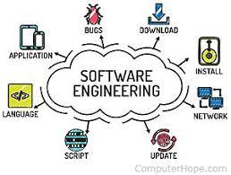

One of the most important things that I have learned in software engineering is how important coding standards are to being an effective programmer as well as how useful it is in agile project management. Coding standards are mainly how you format code within a program to help make it more understandable to other people as well as easier to follow along when debugging or looking for errors. Agile project management however concerns breaking down projects into smaller parts and coordinating with your group members to help finish a project fast and effectively. By incorporating coding standards into agile project management, it helps team members to achieve working together effectively as the members all have a set framework that they can all understand.

## Coding Etiquette

A big part of software engineering is the coding itself and having some etiquette when coding helps you appear as a more competent and organized programmer. Just as how dressing nicely makes you seem more professional, having coding standards helps make you seem like more of a competent programmer. Appearing as a competent programmer opens up lots of doors such as the possibility of more people offering to help you with your programming questions if your code is organized and easier to read. Which is a big part in agile project management as having code that everyone can read helps move your project along quickly.

## Making Group Projects Easier

Agile project management is a useful skill to have when entering the software engineering industry as most of the time you will be working with other people on larger scale projects. The most appealing part of agile project management is how it helps break down big projects into more digestible parts. This is achieved through issue-driven project management where a group addresses some main issues that can be assigned to group members that help break down the project while also helping group members to see something tangible compared to tackling a project as a whole. 

## Final Thoughts on Software Engineering

Software Engineering is a very broad topic, to say the least, and having something simple as building web pages is a good way to be introduced to this field. Having coding etiquette as well as effective group management is pivotal to ensuring success within this field but having a passion for this type of work can also help just as much as speaking for experience having to code days on end can be very life draining even if you do like coding. Having that sense of wonder when approaching any subject helps nudge you just that much more to complete your work.

