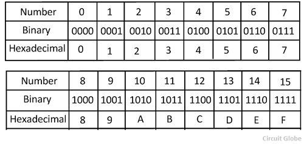

<div class="ui small rounded images">
  
</div>

This is a basic encoding program that translates integer numbers to a hexadecimal encoding. I was the only programmer in this project as it is a basic program which introduced me to hexadecimal encoding as well as how computers are capable of using other numerical systems to encode information. Hexadecimal and integers are basically the same until up to the number 10 where hexadecimal instead uses the letters of the alphabet starting with "A" to represent these values up to the number 15 which is represented as "F". As an example the number 1010 in hexadecimal is 3F2.

Hexadecimal encoding works as follows, we first take the number and see if it matches up to any of the set hexadecimal values such as if the number is 10 then it is "A" or if the number is 11 then it is "B". However if the number is bigger than 15 which is the last hexadecimal value, then we need to divide the number by 16 which represents the 16 hexadecimal values from 0-F. We then keep dividing that number by 16 until we get a quotient of 0. We then take the remainders then match them to their hexadecimal encodings. Here is an example, 1010/16 = 63 remainder 2, 63/16 = 3 remainder 15, 3/16 = 0 remainder 3. Thus we have 3 remainder values of 2,15 and 3. Thus we take the latest remainder which is 3 and match it up to its hexadecimal counterpart which in this case is also 3. Then 15 which is F and finally 2 which is 2. Finally giving the hexadecimal value of 3F2.

We can then translate this into code by first asking if the value is greater than or equal to 16 as if it less than then we can just match a value. If it is greater than or equal to 16 we then divide by 16 as much times as needed by recursing over the function until the first condition where the value >= 16 is false which would then mean we can match and print a hexadecimal value to our value which in this case in now equal to our remainders.

Here is some code that illustrates a part of this process:

```js
if (value >= 16) {               // check if value is greater than or equal to 16
HexDigit = intToHex(value/16);   // Hex Digit is equal to the value/16, keep on doing it until value is not greater than or equal to 16 (intToHex is the name of the function).

} 
return HexDigit + digitToHex(value % 16); // print the last  value of the hexadecimals until it runs then print the HexDigit in front
  }.      // digitToHex is just a function that matches decimal values to hexadecimal values

```

You can learn more at this website which shows a more in-depth explanation of conversions https://www.tutorialspoint.com/how-to-convert-decimal-to-hexadecimal.


