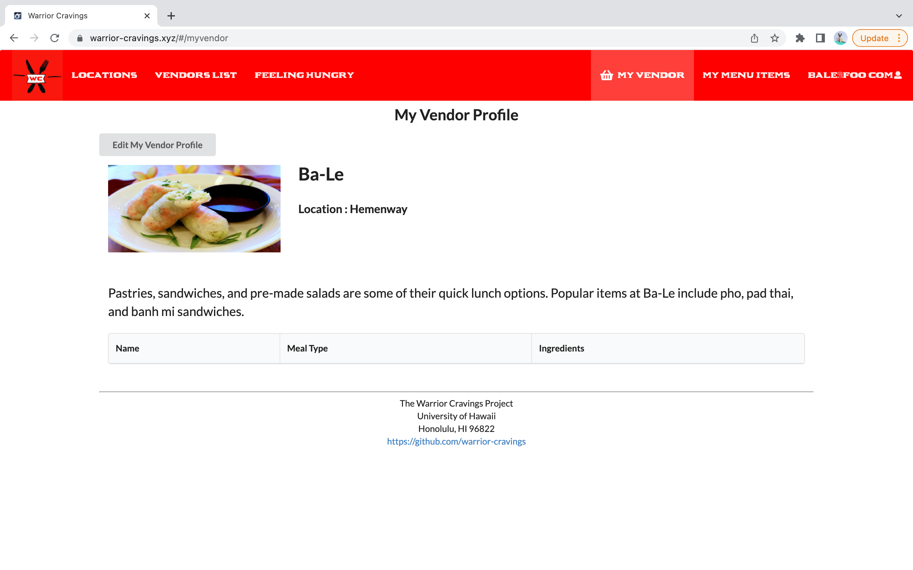

  

Warrior Cravings is a project that I did for my ICS 314 Software Engineering class. I was in a group of 5 people including myself that in which we all worked on different parts of the project. I mainly worked on the user profile pages as well as handled the deployment of the project to the web. This project was a introduction to real life website design as well as practice with using software engineering fundamentals.

This project was done in IntelliJ and heavily used Javascript, Meteor and UI React. A good part of the project was built off a meteor template that in which was provided to us by our instructor. I had gotten to utilize my knowledge of Javascript to be able to render certain pages under if conditions as well as used Meteor and UI React to style website in a cleaner and more professional manner.

The website itself documents the various food vendors and UH Manoa and allows users to make accounts that fit their need. Such as regular users being able to write in their profile concerning their favorite vendors or a little about themselves. Another type of user is the vendor user that in which they can edit their own food vendor page as well as add more menu items to them at will. 

For more information about this project : <a href="https://github.com/warrior-cravings/warrior-cravings"><i class="large github icon "></i>Warrior Cravings</a>
